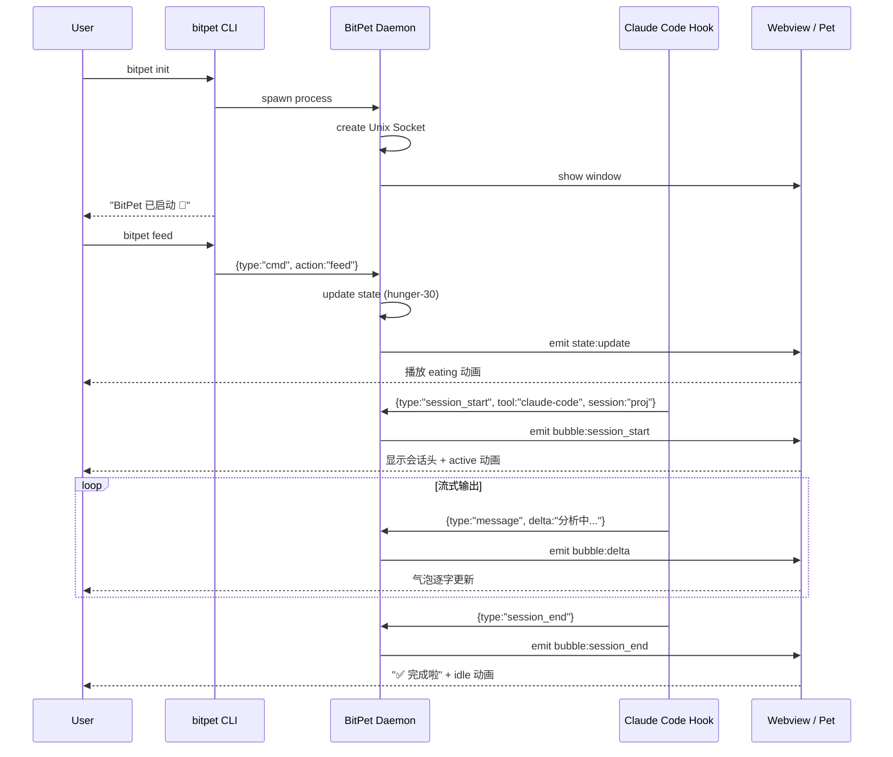

# 设计文档：BitPet（bitpet）

Spec Type: Feature
Workflow: requirements-first
Status: Design Draft
Review Status: confirmed

## 概述

BitPet 由两个独立可执行文件组成：**Daemon**（桌面宠物窗口 + Socket 服务器）和 **CLI**（终端控制命令）。Daemon 作为常驻进程运行，CLI 是无状态的轻量客户端。

设计目标：
- Daemon 内存 < 80MB、CPU idle < 2%
- CLI 响应 < 200ms
- 宠物窗口透明无边框、always-on-top、可拖拽
- IPC 通信健壮，单连接异常不影响整体

不做：桌面端 UI 配置面板（全部通过 CLI 控制）、云端同步、多宠物实例、macOS Login Items 自启动。

**启动入口**：用户在 Claude Code 会话内通过斜杠命令 `/pet init` 启动 Daemon；其余控制命令（feed / play / status / stop）同样通过 `/pet <action>` 触发，底层调用 `bitpet` CLI。`bitpet` CLI 本身仍可独立使用。

**精灵图来源**：由项目内附 Python 脚本（`tools/make_sprites.py`）基于用户提供的参考图（`specs/bitpet/Snipaste_2026-05-04_18-42-09.png`）程序化生成各动画帧，输出为标准精灵图集 `src-tauri/assets/sprites/bitpet.png` + `manifest.json`。

---

## 技术选型

### 方案对比

| 方案 | 内存基线 | 分发包大小 | macOS 集成 | Windows 路径 | 开发体验 |
|------|---------|-----------|-----------|-------------|---------|
| **Tauri v2** ✅ | ~25–40MB | ~8–15MB | WKWebView | WebView2 | Rust + TS |
| Electron | ~100–130MB | ~120MB | Chromium | Chromium | TS only |
| Swift AppKit | ~10–15MB | ~5MB | 原生最佳 | ✗ 无法移植 | Swift only |
| Python + PyQt6 | ~50–80MB | ~60MB bundled | 中等 | 支持 | Python |

### 选型决策：Tauri v2

**理由：**
1. **内存**：WKWebView 在 macOS 上由系统共享，额外内存仅 Rust 进程开销（~5MB），总计约 25–40MB，满足 < 80MB 要求。
2. **IPC Socket**：Rust + Tokio 异步运行时天然适合 Unix Socket 服务器，代码简洁且高效。
3. **动画渲染**：前端 TypeScript + Canvas 2D API 渲染像素精灵动画，帧率稳定，浏览器已优化。
4. **跨平台路径**：macOS 用 WKWebView，Windows 用 WebView2，前端代码无需修改。
5. **透明窗口**：Tauri 支持 `transparent: true` + `decorations: false`，always-on-top 通过 `always_on_top: true` 实现。

**CLI 工具**：单独的 Node.js 脚本（`bitpet` npm 包），通过 Unix Socket 向 Daemon 发送 JSON 命令。之所以选 Node.js 而非 Rust 二进制：开发者已有 Node 环境（Claude Code / npm 生态），安装更简便（`npm install -g bitpet`）。

---

## 架构

```
┌─────────────────────────────────────────────────────┐
│                    macOS Desktop                    │
│                                                     │
│  ┌──────────────────────────────────────────────┐   │
│  │              BitPet Daemon (Tauri)            │   │
│  │                                              │   │
│  │  ┌─────────────────┐  ┌──────────────────┐  │   │
│  │  │  Webview Window │  │   Rust Backend   │  │   │
│  │  │  (TS + Canvas)  │  │  (Tauri Core)    │  │   │
│  │  │                 │  │                  │  │   │
│  │  │  PixelSprite    │  │  SocketServer    │  │   │
│  │  │  BubbleLayer    │◄─┤  (tokio + UDS)   │  │   │
│  │  │  PetStateUI     │  │                  │  │   │
│  │  │                 │  │  StateManager    │  │   │
│  │  │                 │  │  (JSON persist)  │  │   │
│  │  └─────────────────┘  └────────┬─────────┘  │   │
│  └──────────────────────────────── │ ──────────┘   │
│                                    │               │
│         Unix Domain Socket         │               │
│         $TMPDIR/bitpet.sock ◄──────┘               │
│                    ▲                               │
└────────────────────┼───────────────────────────────┘
                     │
         ┌───────────┼──────────────┐
         │           │              │
  ┌──────┴──┐  ┌─────┴──────┐  ┌───┴──────────┐
  │ bitpet  │  │ claude code│  │ codex /      │
  │   CLI   │  │   hooks    │  │ opencode     │
  │(Node.js)│  │(shell/json)│  │   hooks      │
  └─────────┘  └────────────┘  └──────────────┘
```

---

## 组件与接口

### 1. `SocketServer`（Rust）

**职责**：监听 Unix Domain Socket，解析 JSON 消息，分发给 StateManager 和前端。

**接口（IPC 协议 v1）**：

```json
// session_start
{ "type": "session_start", "tool": "claude-code", "session": "my-project" }

// message（流式，每次发送增量文本）
{ "type": "message", "tool": "claude-code", "delta": "正在分析代码..." }

// session_end
{ "type": "session_end", "tool": "claude-code" }

// CLI 命令（来自 bitpet CLI）
{ "type": "cmd", "action": "feed" | "play" | "status" | "stop" }
```

响应（仅 cmd 类消息有响应）：

```json
{ "ok": true, "data": { "hunger": 40, "mood": 75, "energy": 60 } }
{ "ok": false, "error": "unknown action" }
```

### 2. `StateManager`（Rust）

**职责**：维护宠物状态，处理衰减逻辑，持久化到 `~/.config/bitpet/state.json`。

**状态结构**：

```rust
struct PetState {
    hunger: u8,      // 0=饱, 100=极饿
    mood: u8,        // 0=沮丧, 100=快乐
    energy: u8,      // 0=耗尽, 100=充沛
    position: (f32, f32),  // 窗口位置（相对屏幕右下角偏移）
    last_active: i64,      // Unix timestamp
}
```

**衰减定时器**：每 30 分钟触发一次（tokio interval），hunger +10，energy -5，边界 clamp(0, 100)。

### 3. `PixelSprite`（TypeScript + Canvas 2D）

**职责**：加载精灵图集（sprite sheet），按帧序列播放动画，响应状态变化切换动画集。

**精灵图集格式**：

```
sprites/bitpet.png  — 8x8 网格，每帧 64×64px，共 64 帧
sprites/manifest.json — 定义各动画名与帧索引范围
```

**动画状态机**：

```
idle ──hover──► hover
idle ◄──leave── hover
idle ──poke──► poked ──(1.5s)──► idle
idle ──feed cmd──► eating ──(2s)──► happy ──(3s)──► idle
idle ──play cmd──► playing ──(3s)──► idle
idle ──hunger≥80──► hungry (持续)
idle ──energy≤20──► sleeping (持续)
any  ──session_start──► active (持续至 session_end)
```

### 4. `BubbleLayer`（TypeScript）

**职责**：接收来自 Rust 后端的 Tauri event，流式更新聊天气泡文字，管理气泡生命周期。

**Tauri 事件**：

```typescript
// Rust → Frontend
listen('bubble:delta', (e) => updateBubble(e.payload.delta))
listen('bubble:session_start', (e) => showSessionHeader(e.payload))
listen('bubble:session_end', () => showCompleteBubble())
listen('state:update', (e) => updatePetAnimation(e.payload))
```

**气泡截断规则**：累计文本超过 100 字符时，保留最新 100 字符并在头部显示 "…"。

### 5. `bitpet` CLI（Node.js）

**职责**：连接 Socket，发送 cmd 消息，打印结果；`init` 时负责启动 Daemon。

**命令映射**：

```
bitpet init        → 检查 Daemon 是否运行 → 未运行则 spawn Daemon 进程 → 等待 Socket 就绪
bitpet feed        → { type:"cmd", action:"feed" }
bitpet play        → { type:"cmd", action:"play" }
bitpet status      → { type:"cmd", action:"status" } → 格式化输出
bitpet stop        → { type:"cmd", action:"stop" }
bitpet setup-hooks [--tool claude|codex|opencode]
                   → 输出 hooks 配置片段并给出逐步指引
```

**Claude Code 斜杠命令**（安装在 `~/.claude/commands/pet.md`）：

```markdown
---
description: BitPet 控制命令，管理你的桌面宠物
---
!bitpet $ARGUMENTS
```

用法示例：
```
/pet init     → 启动宠物
/pet feed     → 喂食
/pet play     → 玩耍
/pet status   → 查看状态
/pet stop     → 关闭宠物
```

---

## 数据模型

### `~/.config/bitpet/state.json`

```json
{
  "version": 1,
  "pet": {
    "hunger": 40,
    "mood": 75,
    "energy": 60,
    "position": { "x": -120, "y": -120 },
    "last_active": 1746360000
  }
}
```

### `~/.config/bitpet/config.json`

```json
{
  "version": 1,
  "socket_path": "/tmp/bitpet.sock",
  "bubble_max_chars": 100,
  "decay_interval_minutes": 30,
  "autostart": false
}
```

---

## 视觉设计：BitPet 角色

### 参考与改造方向

原截图：圆滚滚奇比精灵，棕色森系配色，腮红圆脸，chibi 比例（头身比约 1:1）。

**BitPet 改造**：保留圆润比例和可爱腮红，改为数字生命题材：

```
调色板（8色 + 透明）：
  身体主色  #5B8DEF  (科技蓝)
  身体阴影  #3A5FBF  (深蓝)
  腹部高光  #A8C8FF  (浅蓝)
  腮红      #FF8FAB  (粉红)
  眼睛      #1A1A2E  (深蓝黑)
  眼白高光  #FFFFFF
  天线/细节 #FFD700  (金黄)
  轮廓      #2C2C54  (深紫黑)
```

**帧动画规格**（64×64px，8bpp 索引色 PNG）：

| 动画名 | 帧数 | FPS | 说明 |
|--------|------|-----|------|
| idle | 4 | 4 | 轻微呼吸起伏 |
| hover | 4 | 8 | 眼睛发光，微微发抖 |
| poked | 6 | 10 | 被戳弹起，表情惊讶 |
| eating | 8 | 10 | 张嘴咀嚼，星星眼 |
| playing | 8 | 12 | 跳跃旋转 |
| sleeping | 6 | 3 | 闭眼，Zzz 气泡 |
| hungry | 4 | 4 | 耷拉眼皮，慢速摇头 |
| active | 4 | 8 | 天线发光，专注表情 |

---

## Hook 配置指引（`bitpet setup-hooks` 输出内容）

### Claude Code

在终端执行 `bitpet setup-hooks --tool claude`，将输出：

```
== BitPet × Claude Code 配置指引 ==

1. 打开（或创建）文件：
   ~/.claude/settings.json

2. 在 "hooks" 字段中添加以下内容：

   "hooks": {
     "PostToolUse": [
       {
         "matcher": "",
         "hooks": [
           {
             "type": "command",
             "command": "bitpet-hook claude-code \"$CLAUDE_TOOL_OUTPUT\""
           }
         ]
       }
     ],
     "Stop": [
       {
         "matcher": "",
         "hooks": [
           {
             "type": "command",
             "command": "bitpet-hook session-end claude-code"
           }
         ]
       }
     ]
   }

3. 新开一个 Claude Code 会话验证：
   claude  →  观察宠物是否切换为"active"状态并显示气泡。
```

`bitpet-hook` 是随 `bitpet` 一并安装的辅助脚本，负责将环境变量和参数格式化为 Socket JSON 并发送。

---

## 流程



---

## 错误处理

| 场景 | 处理方式 |
|------|---------|
| Socket 文件存在但无响应 | `bitpet init` 删除旧文件后重建 |
| Daemon 崩溃 | Tauri 进程退出，Socket 自动清理；窗口消失；下次 `init` 恢复 |
| 消息速率 > 10/s | Daemon 丢弃超出消息（rate limiter per connection），保留最新 |
| 连接异常断开 | 静默清理连接，不影响其他连接 |
| 屏幕布局变化 | 监听 `NSApplicationDidChangeScreenParametersNotification`，重新 clamp 位置 |
| state.json 损坏 | 回退到默认值并重写文件 |

---

## 安全与隐私

- Unix Domain Socket 仅本地用户可读写（文件权限 0600）。
- BitPet 不联网，不收集任何数据。
- Hook 脚本接收的 Claude Code 输出在本地处理，不离开设备。
- `bitpet-hook` 脚本截断超过 500 字符的输出，防止 UI 被超长文本淹没。

---

## 性能与可靠性

- Tauri WebView 使用 `requestAnimationFrame` 驱动精灵动画，idle 时 GPU 占用接近 0。
- 状态衰减定时器精度 ±5 秒（tokio interval），对用户体验无影响。
- Socket 服务器使用 tokio 异步多路复用，非阻塞。
- 窗口始终保持渲染，不使用 `willHide` 隐藏（避免 macOS 动画抖动）。

---

## 测试策略

- **单元测试**：StateManager 衰减逻辑、状态边界（Rust `#[test]`）
- **集成测试**：Socket 消息收发、cmd 响应格式（Rust + Node.js 端到端）
- **UI 快照测试**：各动画帧首帧截图比对（Playwright / Tauri test utils）
- **手动验收**：
  1. `bitpet init` → 窗口出现
  2. `bitpet feed` → eating 动画
  3. Claude Code hook → active 动画 + 气泡
  4. 30 分钟不操作 → hungry 状态

---

## 正确性属性

### 属性 1：状态衰减单调性

*对任意初始状态*，当 30 分钟无交互时，hunger 值单调递增（边界除外），energy 单调递减。不存在未经用户操作的自增 mood 或自减 hunger。

**验证：需求 2.2, 2.3**

### 属性 2：Socket 消息幂等安全性

*对任意 cmd 消息*，重复发送同一命令不超过一次计入状态变化（CLI 不会重试，Daemon 不会双重处理）。

**验证：需求 3.2–3.4**

---

## 风险

| 风险 | 缓解 |
|------|------|
| Tauri v2 在 macOS 上 always-on-top 行为不稳定 | 使用 `NSFloatingWindowLevel` 原生 window level via Tauri plugin-window |
| 像素精灵动画资源缺失（需手工绘制） | MVP 阶段先用 placeholder 色块动画，后期替换精灵图 |
| Claude Code Hook 环境变量 `$CLAUDE_TOOL_OUTPUT` 格式可能变更 | `bitpet-hook` 做防御性解析，失败时发送 empty delta 而非崩溃 |
| 多工具并发时气泡互相覆盖 | 同一时刻只保留一条活跃气泡，后来的 session_start 覆盖前一条 |

---

## 已确认追加决策

- **精灵图**：项目内附 `tools/make_sprites.py`，以参考图为原型程序化生成全套动画帧；用户可替换 `assets/sprites/` 下的图片实现自定义。
- **自启动**：不实现 Login Items。启动入口为 Claude Code 斜杠命令 `/pet init`，`bitpet` CLI 可独立使用。
